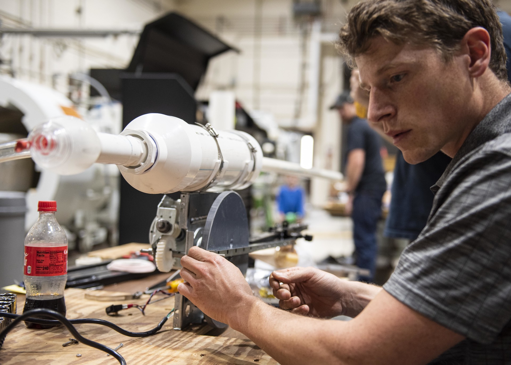

# CPE 1040 - Applied Engineering Ethics

Image credit: [https://www.navsea.navy.mil/Media/Images/igphoto/2002270701/](https://www.navsea.navy.mil/Media/Images/igphoto/2002270701/)

## Exploration 005: Codes of conduct

### 1. Study

This section dives into the task of designing _ethical codes_. Peruse this [collection](https://drdianehamilton.com/top-10-companies-code-of-ethics-and-conduct-2011/) of some of the Codes of Ethics (aka Codes of Conduct) of some of the most prominent technology companies, study the codes, mark the commonalities, and detect any significant differences.

### 2. Apply

1. Ethical codes are vulnerable to the [tragedy of the commons](https://en.wikipedia.org/wiki/Tragedy_of_the_commons). An ethical code relies on the _cooperation_ of the individuals. Discuss how rogue behavior (aka _defection_) with respect to the ethical code of a group gives rise to the [prinsoner's dilemma](https://en.wikipedia.org/wiki/Prisoner's_dilemma) and the eventual demise of the ethical code. _What incentives can you build in the ethical code that would counteract the attractiveness of defection and, as a result, would mitigate the danger to the code?_
2. Imagine you are one of the co-founders of a recent computational technology startup.
   1. Come up with the _technical innovation_ at the heart of your reason to exist and your future product or service.
   2. Describe the ways your innovation, if realized, would affect society: 
      1. List at least 3 adverse effects (including but not limited to _misuse_) of the innovation, as well as some of the anticipatory actions and mechanisms you can embed in its deveopment, distribution, and operation to counteract these effects.
      2. Give an _explicit_ definition of the fine line between the benefit and detriment of your innovation at two moments of innovation's lifetime: (a) immediately upon launch; and (b) after enough time has passed that it has been absorbed into everyday life.   
3. Your small group of co-founders and first few key employees are the pivotal _social kernel_ that can define the proper use of your technology. You have to start early, and hold the line. _How are you going to ensure that you stay the course?_ 
4. Define a Code of Ethics (aka Code of Conduct) for your organization, that will safeguard your original intentions and values while not stiflying innovation as your startup grows and matures. Your code should have _at most 9 points_.

### 3. Present

In the [Study & Discussion](README.md):

1. Include your writing on item 5.2.1.
2. Include your writing on item 5.2.2.
3. Include your writing on item 5.2.3.
4. Include your writing on item 5.2.4.
5. **(CHALLENGE)** Ethical codes are vulnerable to _hostile takeover_ of the adopting organization. Imagine you are one of the acquiring team and you are tasked to sabotage the original team. Remove or modify _3 points_ from The Code, at your discretion, to be the most damaging overall. 
   1. Discuss how and why The Code has been weakened.
   2. Discuss how, in retrospect, the original team should have stated the points of the Code, to forestall sabotage and make it _robust to disruption_. _Note: Beware of the [paradox of self-amendment](https://legacy.earlham.edu/~peters/writing/psaessay.htm), which, in short, **"...arises when a rule is used as the authority for its own amendment. It is sharper when the rule of change is supreme, sharper still when it is changed into a form that is inconsistent with its original form, and sharpest of all when the change purports to be irrevocable."**_

